# Laporan Hasil Praktikum: Final Project Pengembangan ERP Sederhana (Part 2)

## Identitas Mahasiswa

- **Nama:** Faisal Priambodo Putra
- **NIM:** 2415354068
- **Kelas/Rombel:** 4D TRPL
- **Tanggal Praktikum:** 25 Mei 2026

---

## Teknologi & Tools yang Digunakan

- **Sistem Operasi:** Mac OS Ventura
- **Backend Framework:** Laravel 10 / 11 Web API (RESTful API)
- **Frontend Architecture:** Single Page Application (SPA) JavaScript Murni
- **Styling Engine:** Tailwind CSS v4 Framework (Light Mode Template)
- **Database Server:** MySQL (XAMPP Environment)
- **Tools Lain:** VS Code, Google Chrome Developer Tools (Console & Network)

---

## Deskripsi Singkat Project

[cite_start]Pada praktikum tahap Part 2 ini, dilakukan proses *improvement* dan penguatan fitur pada sistem ERP Sederhana yang mencakup manajemen data Customers, Services, dan Subscriptions[cite: 1, 3]. [cite_start]Fokus utama praktikum ini adalah mengimplementasikan aturan bisnis (*Business Rules Validation*) di sisi backend Laravel guna menjaga integritas data antar-tabel [cite: 4, 8][cite_start], serta membangun pembatasan aksi (*Action Restrictions*) secara dinamis di sisi antarmuka frontend JavaScript agar aplikasi kebal dari kesalahan operasional pengguna (*user error*).

[cite_start]Dengan penyempurnaan ini, aplikasi tidak hanya mampu melakukan operasi CRUD standar, melainkan memiliki validasi berlapis yang mensinkronkan status data di database secara *real-time* dengan opsi menu melayang yang tampil di browser[cite: 10, 12, 13].

---

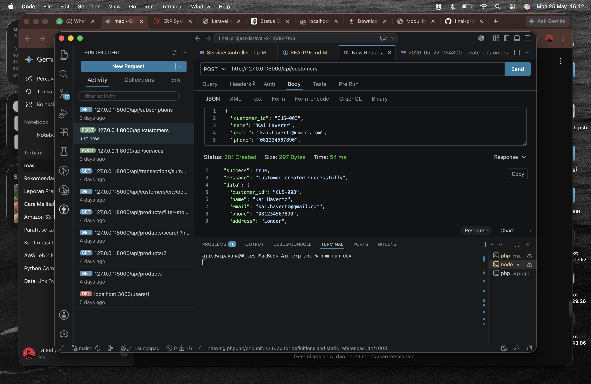
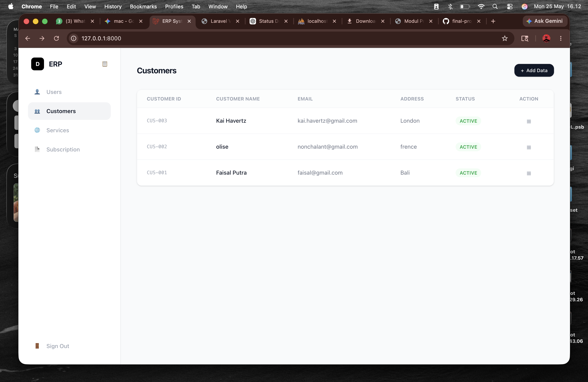
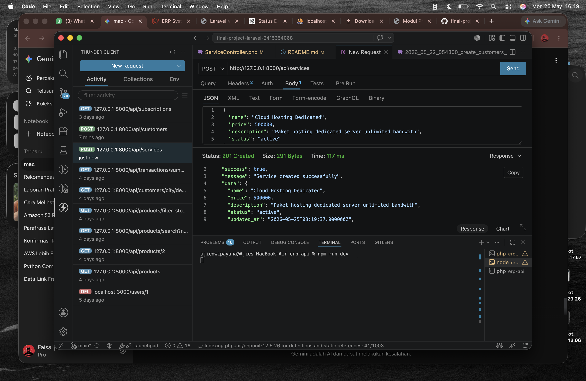
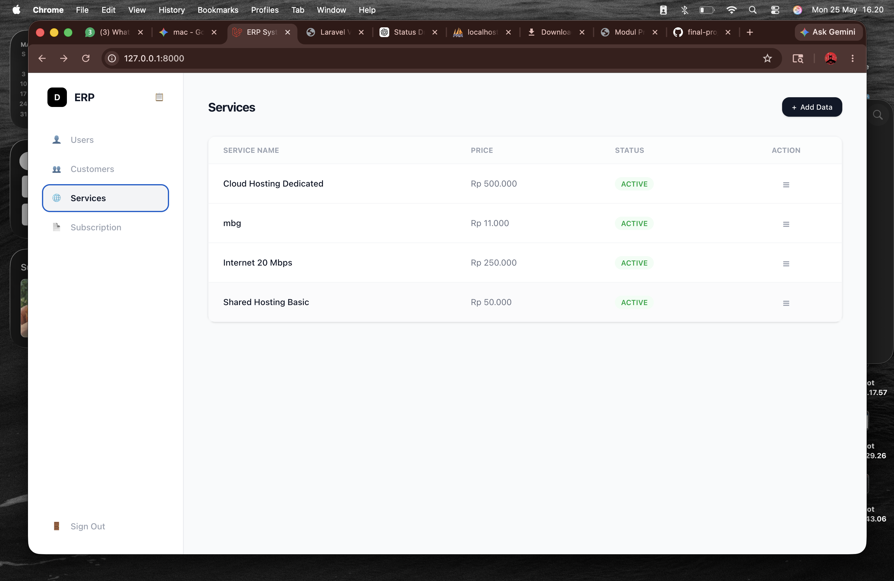
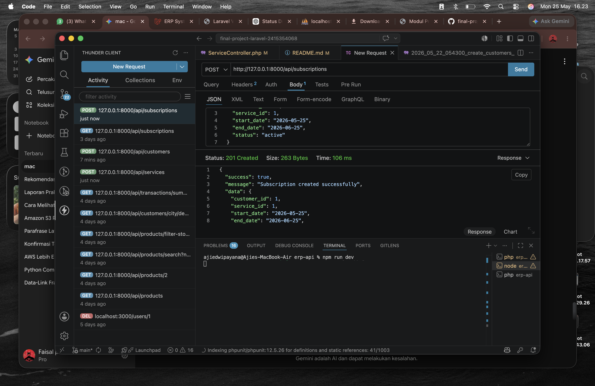
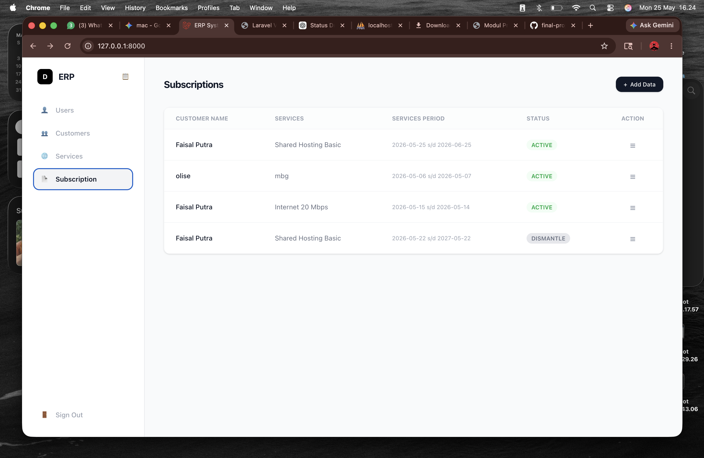


## Langkah-Langkah Praktikum & Dokumentasi

### Langkah 1: Implementasi API & Validasi Penghapusan Relasi (Backend)

[cite_start]Pada tahap pertama, dilakukan pembuatan fungsi `destroy()` di dalam `CustomerController.php` dan `ServiceController.php` untuk menangani request `DELETE`[cite: 4]. [cite_start]Sesuai amanat modul, dipasang logika pengkondisian menggunakan metode `exists()` untuk memeriksa apakah ID entitas yang akan dihapus masih terikat dengan transaksi aktif di dalam tabel `subscriptions`[cite: 5]. [cite_start]Jika terikat, Laravel akan membatalkan proses penghapusan dan mengembalikan response error `422 Unprocessable Entity`[cite: 4].

```php
// Contoh potongan logika validasi relasi pada CustomerController.php
if ($customer->subscriptions()->exists()) {
    return response()->json([
        "success" => false,
        "message" => "Validation failed",
        "errors" => ["customer" => ["Customer yang sudah memiliki Subscription tidak boleh dihapus."]]
    ], 422);
}


// Potongan logika proteksi status dismantle di SubscriptionController.php
if (strtolower($subscription->status) === 'dismantle') {
    return response()->json([
        "success" => false,
        "message" => "Validation failed",
        "errors" => ["status" => ["Status Subscription yang saat ini dismantle tidak bisa diubah ke status lain."]]
    ], 422);
}

// Struktur pemicu modal edit dinamis pada baris tabel app.js
let dropdownContent = `
    <div class="px-4 py-1.5 text-[10px] font-semibold text-gray-400 uppercase tracking-wider border-b border-gray-100">Status Locked</div>
    <button type="button" onclick="openEditCustomer(${c.id}, '${c.customer_id}', '${safeName}', '${safeEmail}')" class="w-full px-4 py-2 text-xs text-gray-700 hover:bg-gray-50 flex items-center gap-2">📝 Edit</button>
    <button type="button" onclick="deleteData(${c.id}, 'customers')" class="w-full px-4 py-2 text-xs text-red-600 hover:bg-red-50 flex items-center gap-2">🗑️ Delete</button>
`;

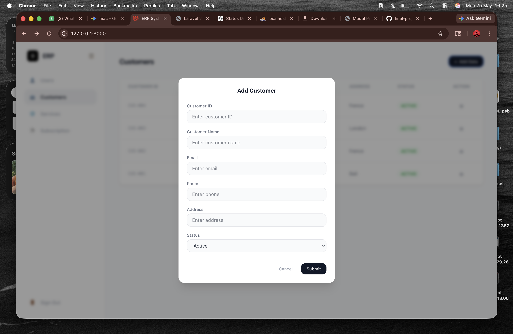
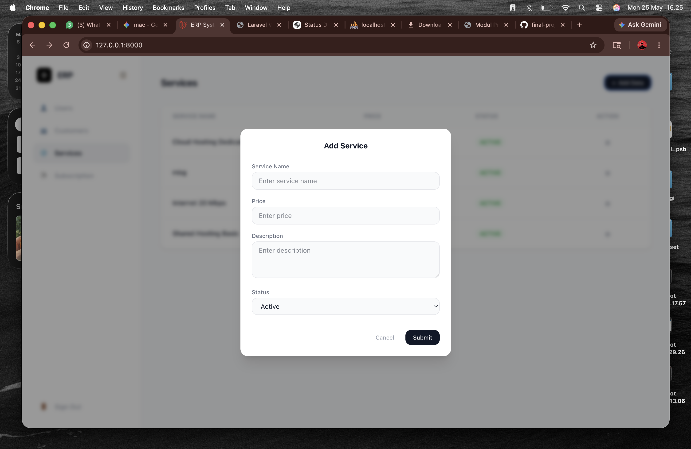
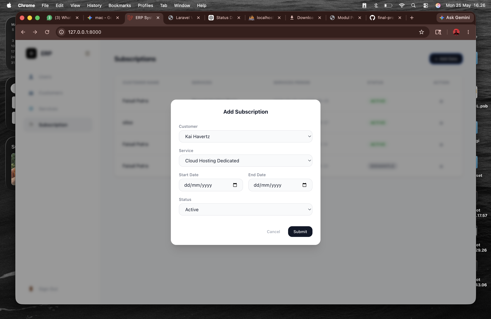
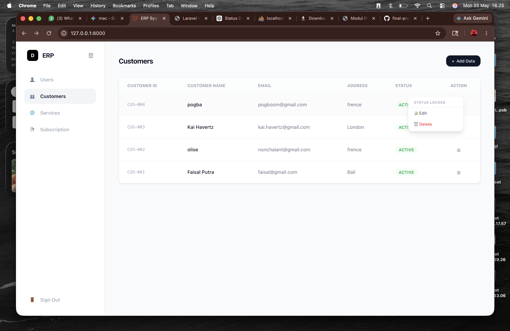
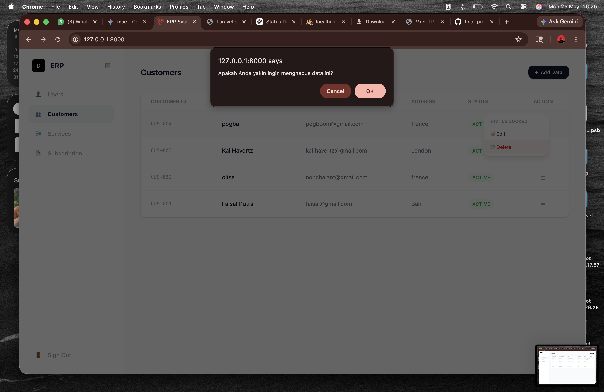

// Logika filter menu status dinamis pada komponen kodingan app.js
if (currentStatus !== 'active') {
    dropdownContent += `<button type="button" onclick="updateSubStatus(${s.id}, 'active')" class="w-full px-4 py-2 text-xs text-gray-700 flex items-center gap-2">🔑 Active</button>`;
}
if (currentStatus !== 'inactive') {
    dropdownContent += `<button type="button" onclick="updateSubStatus(${s.id}, 'inactive')" class="w-full px-4 py-2 text-xs text-gray-700 flex items-center gap-2">🔓 Inactive</button>`;
}

//KESIMPULAN
Improvement sistem ERP pada praktikum Part 2 berhasil memperkuat aspek keamanan pengolahan data. Melalui penggabungan validasi backend Laravel (menggunakan metode pengecekan exists() relasi database) dan manipulasi antarmuka frontend (menggunakan pengekangan kondisi string JavaScript) , sistem mampu mencegah terjadinya kerusakan data akibat orphan data maupun kecurangan manipulasi perubahan status data secara ilegal. Seluruh fungsi CRUD dan restriksi fitur telah berjalan selaras, stabil, dan siap digunakan di lingkungan produksi.